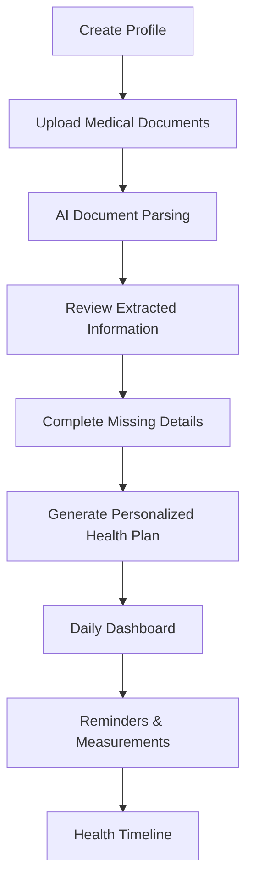
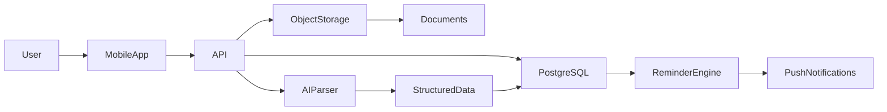

# HealthPal---SIIAM-Health-AI-Labs
# Patient-Centered Health Platform

> A personal health operating system that consolidates medical records, treatment plans, medications, measurements, and reminders into one secure and patient-owned platform.

---

## 📖 Overview

People living with chronic conditions often manage information scattered across:

* Multiple healthcare providers
* Laboratories
* Pharmacies
* Hospitals
* Personal notes and paper records

As a result, patients struggle to maintain a complete and up-to-date view of their health history.

The **Patient-Centered Health Platform** solves this problem by providing a secure, centralized hub where users can:

✅ Upload medical documents
✅ Track medications and treatment plans
✅ Record clinical measurements
✅ Receive reminders for health-related tasks
✅ Maintain a longitudinal health timeline

The platform transforms fragmented medical information into a structured and accessible health record that can travel with the patient across providers and care settings.

---

# 🎯 MVP Goal

The first version focuses on a single mission:

> **Help patients organize their health information and stay on top of daily treatment responsibilities.**

The MVP intentionally avoids complex clinical decision-making and instead concentrates on:

* Record consolidation
* Medication adherence
* Measurement tracking
* Appointment management
* AI-powered document extraction

---

# ✨ Core Features

## 📂 Medical Document Repository

Upload and securely store:

* Laboratory results
* Prescriptions
* Clinical reports
* Hospital discharge summaries
* Referrals

The platform automatically extracts relevant information and organizes it into structured records.

---

## 🤖 AI Document Parsing

Medical documents are processed and transformed into structured data.

### Extracted Information

* Diagnosed conditions
* Medications
* Dosages
* Monitoring requirements
* Follow-up appointments
* Prescription renewals

### Example Output

```json
{
  "condition": "Type 2 Diabetes",
  "medications": [
    {
      "name": "Metformin",
      "dosage": "500mg"
    }
  ],
  "monitoring": [
    {
      "type": "Blood Glucose",
      "frequency": "Daily"
    }
  ]
}
```

---

## 💊 Medication Management

Track:

* Active medications
* Dosages
* Administration schedules
* Prescription renewals

Example:

| Medication | Dose  | Schedule      |
| ---------- | ----- | ------------- |
| Metformin  | 500mg | 08:00 & 20:00 |
| Lisinopril | 10mg  | 09:00         |

---

## ⏰ Reminder Engine

Automatically generates reminders for:

* Medication intake
* Blood glucose checks
* Blood pressure monitoring
* Weight measurements
* Medical appointments
* Prescription renewals

Users can:

* Mark tasks as completed
* Defer tasks
* View pending reminders

---

## 📈 Health Measurements

Record longitudinal health metrics such as:

* Blood glucose
* Blood pressure
* Body weight
* Future biometric measurements

Each entry is timestamped and added to the patient timeline.

---

## 🕒 Longitudinal Health Timeline

A chronological history of:

* Uploaded documents
* Diagnoses
* Medication activities
* Measurements
* Appointments
* Prescription renewals

This becomes a portable health history that can be shared with healthcare professionals.

---

# 👤 User Journey



---

# 🏗 System Architecture



---

# 🗄 Data Model

## Core Entities

### User

```text
- Name
- Date of Birth
- Sex
- Height
- Weight
```

### Condition

```text
- Diagnosis
- Diagnosis Date
- Status
```

### Medication

```text
- Drug Name
- Dosage
```

### Medication Schedule

```text
- Time
- Frequency
```

### Monitoring Task

```text
- Type
- Frequency
- Scheduled Time
```

### Appointment Task

```text
- Appointment Type
- Last Visit Date
- Frequency
```

### Prescription Renewal

```text
- Medication
- Renewal Frequency
```

### Measurement

```text
- Metric Type
- Value
- Unit
- Timestamp
```

### Document

```text
- File Reference
- Upload Date
- Document Type
```

---

# 📱 MVP Screens

## 1. Onboarding

* Create profile
* Upload records
* Review extracted information
* Configure schedules

## 2. Dashboard

Daily task list:

```text
07:00 Blood Glucose Check
08:00 Metformin
20:00 Metformin
```

Actions:

* ✅ Complete
* ⏳ Defer

---

## 3. Measurement Entry

Simple forms for:

* Blood glucose
* Blood pressure
* Weight

---

## 4. Timeline

Unified health history view.

---

# 🛠 Technology Stack

| Layer          | Technology                      |
| -------------- | ------------------------------- |
| Mobile App     | Flutter                         |
| Backend API    | FastAPI                         |
| Database       | PostgreSQL                      |
| Authentication | Supabase Auth / Firebase Auth   |
| File Storage   | S3-Compatible Storage           |
| Notifications  | Firebase Cloud Messaging        |
| AI Processing  | LLM-powered Document Extraction |

---

# 🚀 Development Roadmap

| Sprint   | Duration    | Deliverable                                      |
| -------- | ----------- | ------------------------------------------------ |
| Sprint 1 | Weeks 1–2   | Database schema, authentication, patient profile |
| Sprint 2 | Weeks 3–4   | Document upload and storage                      |
| Sprint 3 | Weeks 5–6   | AI extraction pipeline                           |
| Sprint 4 | Weeks 7–8   | Health plan generation and reminders             |
| Sprint 5 | Weeks 9–10  | Measurements and timeline                        |
| Sprint 6 | Weeks 11–12 | Testing, bug fixing, performance hardening       |

---

# 🚫 Out of Scope (MVP)

The following features are intentionally excluded:

* Pharmacy integrations
* National health system integrations
* Appointment booking
* Smartwatch integrations
* Caregiver accounts
* Multi-user support
* Clinical recommendations
* Diagnostic assistance
* Automated healthcare decisions

Maintaining a narrow scope increases delivery speed, reliability, and regulatory safety.

---

# 🔮 Future Vision

## AI Voice Agent

A proactive assistant capable of:

* Calling patients when reminders are ignored
* Checking treatment adherence
* Supporting appointment coordination
* Assisting with prescription renewals

---

## Health Trend Detection

Analyze longitudinal data to identify:

* Blood glucose deterioration
* Blood pressure abnormalities
* Adherence issues
* Emerging risk patterns

---

## Predictive Healthcare

Future releases may support:

* Risk scoring
* Preventive care recommendations
* Wearable integrations
* Pharmacy integrations
* National health record interoperability

---

# 🌍 Long-Term Vision

The ultimate objective is to create a:

> **Persistent Personal Health Memory**

A continuously updated, patient-owned health record that follows individuals across providers, conditions, and years—making healthcare more coordinated, personalized, and proactive.

---

## License

This project is currently in the proposal and MVP planning phase.

